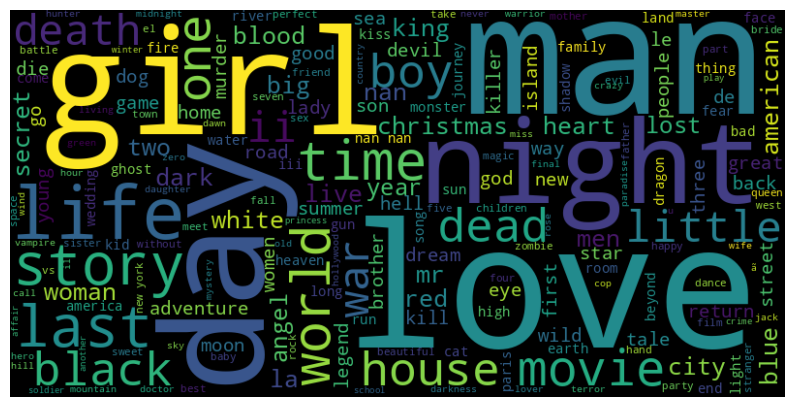
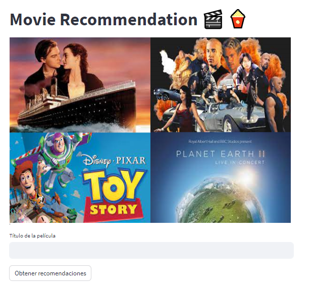

<h1 align='center'>
 <b>Proyecto  Individual I</b>
</h1>

***
<h1 align='center'>
<b>Movie Recommendation🎬🍿</b>
</h1>

<p align="center">
  
</p>

***
En este proyecto de Machine Learning, asumiré el rol de un _Data Engineer_ y realizaré todos los procesos necesarios, desde el tratamiento y recolección de datos hasta el entrenamiento y mantenimiento del modelo de ML a medida que llegan nuevos datos. El proyecto se desarrollará en varias etapas, que incluyen:


**Proceso de ETL (Extracción, Transformación, Carga)**: En el archivo _ETL.py_, se llevó a cabo el proceso de extracción de datos de diversas fuentes, la transformación de los datos para su limpieza y preparación, y finalmente la carga de los datos en un formato adecuado ( archivo _movies_final.csv_) para su posterior análisis y entrenamiento del modelo.

**Análisis Exploratorio de Datos (EDA)**: En el notebook _EDA.ipynb_, se realizará un análisis exhaustivo de los datos recopilados. Esto incluirá la visualización de los datos, la identificación de patrones, la detección de valores atípicos y la generación de ideas y preguntas relevantes para el problema que estamos abordando.

**Desarrollo del Modelo de Machine Learning**: En el archivo _ml_model.py_, se implementará un modelo de machine learning utilizando el algoritmo de vecinos más cercanos (K-Nearest Neighbors). Este modelo se entrenará utilizando los datos recopilados y preparados en las etapas anteriores.

**Implementación de la Interfaz**: En el archivo _main.py_, se creará una interfaz utilizando la biblioteca FastAPI. Esta interfaz permitirá a los usuarios interactuar con el modelo de machine learning, proporcionando los datos de entrada necesarios y obteniendo las predicciones correspondientes.

**Despliegue y Implementación**: Finalmente, se llevará a cabo el despliegue del proyecto utilizando Streamlit y se realizará la implementación en un entorno de producción utilizando Render. Esto permitirá que el modelo y la interfaz estén disponibles en línea y sean accesibles para los usuarios.

A través de estas etapas, se abordarán todos los aspectos clave del proceso de desarrollo de un proyecto de Machine Learning, desde la recolección y preparación de datos hasta la implementación de un modelo funcional y su despliegue en un entorno de producción.

***

### **📒Información General**
***
1. Desde el _Anaconda Prompt_ se crea un nuevo entorno y se instalan todas las librerías necesarias.

```
#Creamos un nuevo entorno
conda create --name newApi

#Instalamos las librerías 
conda install pandas
conda install scikit-learn
pip install fastapi
pip install "uvicorn[standar]"
pip install streamlit
```
2. Se realiza todo el proceso de ETL, de los datos proporcionados inicialmente, quedando como resultado el data set _movies_final.csv_.

3. Se realiza el análisis exploratorio de datos (EDA.ipynb), se examinan las variables cualitativas y cuantitativas de la base de datos. En el caso específico de los títulos de películas, se utiliza una nube de palabras para identificar las palabras más frecuentes.

<p align="center">
  
</p>

4. Se crea el archivo _main.py_, donde se cargan las siguientes librerias:

* fastapi
* pandas

Dentro de este mismo archivo, se generan las siguientes funciones, encargadas del sistema de consultas:

* _movies_language(language)_: Calcula la cantidad de filmaciones producidas en el idioma de entrada.
* _duration_movies(movie)_: Calcula la duración de la película de entrada y el año de estreno. 
* _collection(collection)_: Al ingresar el nombre de la colección o saga de un grupo de películas, trae la cantidad de películas de la saga, ganancia total y promedio.
* votos_titulo(titulo): Al ingresar el título de la película, trae el título, votos y votos promedio.
* _movie_country(country)_: Al ingresar el país, retorna la cantidad de películas producidas en el país ingresado.
* _get_director(director)_: Al ingresar el nombre del director, trae el nombre del director, títulos de las películas realizadas, fecha de lanzamiento, retorno, presupuesto y ganancias.


5. Se crea el archivo _ml_model.py_, en el cual se cargan las siguientes librerias:

* pandas
* sklearn
* streamlit

En el archivo _ml_model.py_  se carga el dataset _movies_final.csv_, el que se siguen los siguientes pasos, para crear el modelo de machine learning:

* Se carga el dataset _movies_final.csv_ 
* Se toman las columnas 'title', 'collection_movie', 'original_language', 'genres', 'overview', 'popularity', 'production_companies', 'production_countries', 'release_date', 'actors', 'director', y se genera una sola columna llamada 'features', que combina a las anteriores.
* Se crea la matriz TF-IDF que captura la importancia relativa de los términos en cada documento en relación con el corpus.
* Se crea  una instancia del modelo de vecinos más cercanos y se entrena con la  matriz TF-IDF generada previamente en función de la similitud del coseno en el espacio de características TF-IDF.
* Se generan las siguientes funciones: get_recomendations(), user_input, main. La primera se encarga de utiliza el modelo de vecinos más cercanos para encontrar películas similares a partir de un título dado, y devuelve una lista de los títulos de las películas recomendadas. La segunda gestiona las acciones del usuario y la tercera gestiona la aplicación principal.

6. Generamos nuestra aplicación web en el servidor, empleando el Anaconda Promt, de la siguiente manera:

```
#Para activar el ambiente donde tenemos nuestras librerías
conda activate env

#Vamos a nuestra carpeta de trabajo
cd rutaCarpeta

#Para  generar nuestra aplicación
rutaCarpeta>python ml_model.py

#Para ver nuestra aplicación enla web
rutaCarpeta>streamlit run ml_model.py

```
Vista previa de la aplicacion web, generada con streamlit.

<p align="center">
  
</p>

7. Se realiza el deploy en del API de consultas de películas en <A HREF="https://render.com/">Render</A>.

8. Se realiza un video explicativo, que se puede encontrar en <A HREF="https://www.youtube.com/">youtube</A>.

***
## **📎Links**
* <A HREF="">API  de consultas de películas </A>.
 
* <A HREF="https://p1-6n55x3niz6b.streamlit.app/"> Recomendacion de películas.</A> 

## **👀Recomendaciones**
***
* Emplear solamente minúsculas.
* No hacer uso de caracteres especiales.

## **📈Tecnologías**
***
Una lista de tecnologías utilizadas en el proyecto:
* 🐍[Python](https://docs.python.org/3/): Version 3.85
* 🐼[Pandas](https://pandas.pydata.org/): Version 3.3.0
* 💻[Numpy](https://numpy.org/doc/): Version 3.2.0
* 📊[scikit learn](https://scikit-learn.org/stable/): Version 1.1.3
* 📳[FastApi](https://fastapi.tiangolo.com/): Version 0.96.0
* 🦄[Uvicorn](https://www.uvicorn.org/): Version 0.22.0
* 🖥[Streamlimit](https://streamlit.io/): Version 1.23.1

## **Autor 🧜‍♀️**
***

* Andrea Huertas 
* correo electronico: andrehuertasg@gmail.com 
* linkedin: https://www.linkedin.com/in/luz-andrea-huertas-guerrero-30bb7a237/
